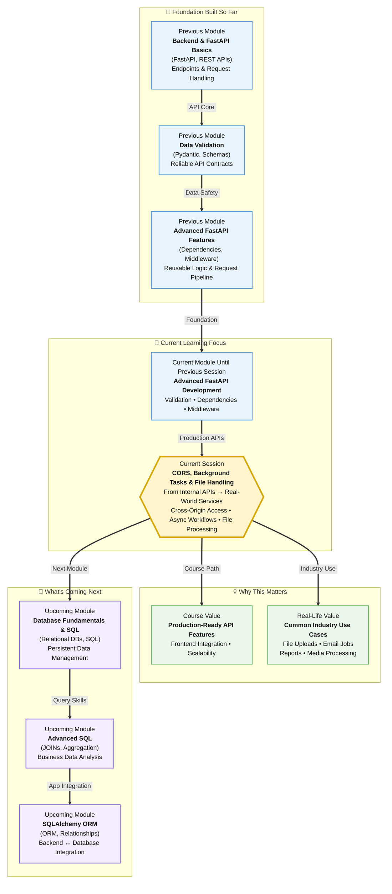

```mermaid
%%{init: {
  "flowchart": {
    "nodeSpacing": 40,
    "rankSpacing": 70,
    "diagramPadding": 20
  }
}}%%

flowchart TB

subgraph Foundation["🚀 Foundation Built So Far"]
    P1["Previous Module<br/><b>Backend & FastAPI Basics</b><br/>(FastAPI, REST APIs)<br/>Endpoints & Request Handling"]

    P2["Previous Module<br/><b>Data Validation</b><br/>(Pydantic, Schemas)<br/>Reliable API Contracts"]

    P3["Previous Module<br/><b>Advanced FastAPI Features</b><br/>(Dependencies, Middleware)<br/>Reusable Logic & Request Pipeline"]
end

subgraph Present["🎯 Current Learning Focus"]
    CM["Current Module Until Previous Session<br/><b>Advanced FastAPI Development</b><br/>Validation • Dependencies • Middleware"]

    CS{{"Current Session<br/><b>CORS, Background Tasks & File Handling</b><br/>From Internal APIs → Real-World Services<br/>Cross-Origin Access • Async Workflows • File Processing"}}
end

subgraph Value["💡 Why This Matters"]
    CV["Course Value<br/><b>Production-Ready API Features</b><br/>Frontend Integration • Scalability"]

    RV["Real-Life Value<br/><b>Common Industry Use Cases</b><br/>File Uploads • Email Jobs<br/>Reports • Media Processing"]
end

subgraph Future["🔮 What's Coming Next"]
    U1["Upcoming Module<br/><b>Database Fundamentals & SQL</b><br/>(Relational DBs, SQL)<br/>Persistent Data Management"]

    U2["Upcoming Module<br/><b>Advanced SQL</b><br/>(JOINs, Aggregation)<br/>Business Data Analysis"]

    U3["Upcoming Module<br/><b>SQLAlchemy ORM</b><br/>(ORM, Relationships)<br/>Backend ↔ Database Integration"]
end

P1 ==>|&nbsp;API Core&nbsp;| P2
P2 ==>|&nbsp;Data Safety&nbsp;| P3
P3 ==>|&nbsp;Foundation&nbsp;| CM

CM ==>|&nbsp;Production APIs&nbsp;| CS

CS ==>|&nbsp;Course Path&nbsp;| CV
CS ==>|&nbsp;Industry Use&nbsp;| RV

CS ==>|&nbsp;Next Module&nbsp;| U1
U1 ==>|&nbsp;Query Skills&nbsp;| U2
U2 ==>|&nbsp;App Integration&nbsp;| U3

classDef previous fill:#E8F4FD,stroke:#5B9BD5,stroke-width:2px,color:#111;
classDef current fill:#FFF4CC,stroke:#D6A800,stroke-width:4px,color:#111;
classDef value fill:#EAF7EA,stroke:#67B567,stroke-width:2px,color:#111;
classDef future fill:#F4ECFF,stroke:#8A6FD1,stroke-width:2px,color:#111;

class P1,P2,P3,CM previous;
class CS current;
class CV,RV value;
class U1,U2,U3 future;

linkStyle default stroke-width:3px
```