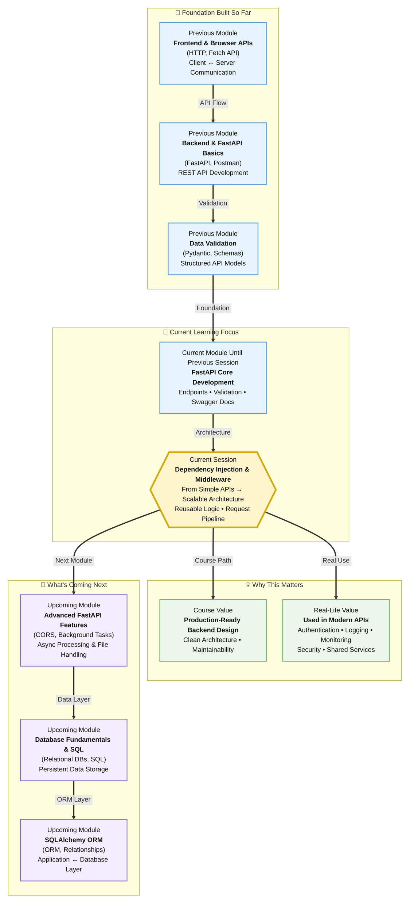

```mermaid
%%{init: {
  "flowchart": {
    "nodeSpacing": 40,
    "rankSpacing": 70,
    "diagramPadding": 20
  }
}}%%

flowchart TB

subgraph Foundation["🚀 Foundation Built So Far"]
    P1["Previous Module<br/><b>Frontend & Browser APIs</b><br/>(HTTP, Fetch API)<br/>Client ↔ Server Communication"]
    P2["Previous Module<br/><b>Backend & FastAPI Basics</b><br/>(FastAPI, Postman)<br/>REST API Development"]
    P3["Previous Module<br/><b>Data Validation</b><br/>(Pydantic, Schemas)<br/>Structured API Models"]
end

subgraph Present["🎯 Current Learning Focus"]
    CM["Current Module Until Previous Session<br/><b>FastAPI Core Development</b><br/>Endpoints • Validation • Swagger Docs"]

    CS{{"Current Session<br/><b>Dependency Injection & Middleware</b><br/>From Simple APIs → Scalable Architecture<br/>Reusable Logic • Request Pipeline"}}
end

subgraph Value["💡 Why This Matters"]
    CV["Course Value<br/><b>Production-Ready Backend Design</b><br/>Clean Architecture • Maintainability"]

    RV["Real-Life Value<br/><b>Used in Modern APIs</b><br/>Authentication • Logging • Monitoring<br/>Security • Shared Services"]
end

subgraph Future["🔮 What's Coming Next"]
    U1["Upcoming Module<br/><b>Advanced FastAPI Features</b><br/>(CORS, Background Tasks)<br/>Async Processing & File Handling"]

    U2["Upcoming Module<br/><b>Database Fundamentals & SQL</b><br/>(Relational DBs, SQL)<br/>Persistent Data Storage"]

    U3["Upcoming Module<br/><b>SQLAlchemy ORM</b><br/>(ORM, Relationships)<br/>Application ↔ Database Layer"]
end

P1 ==>|&nbsp;API Flow&nbsp;| P2
P2 ==>|&nbsp;Validation&nbsp;| P3
P3 ==>|&nbsp;Foundation&nbsp;| CM

CM ==>|&nbsp;Architecture&nbsp;| CS

CS ==>|&nbsp;Course Path&nbsp;| CV
CS ==>|&nbsp;Real Use&nbsp;| RV

CS ==>|&nbsp;Next Module&nbsp;| U1
U1 ==>|&nbsp;Data Layer&nbsp;| U2
U2 ==>|&nbsp;ORM Layer&nbsp;| U3

classDef previous fill:#E8F4FD,stroke:#5B9BD5,stroke-width:2px,color:#111;
classDef current fill:#FFF4CC,stroke:#D6A800,stroke-width:4px,color:#111;
classDef value fill:#EAF7EA,stroke:#67B567,stroke-width:2px,color:#111;
classDef future fill:#F4ECFF,stroke:#8A6FD1,stroke-width:2px,color:#111;

class P1,P2,P3,CM previous;
class CS current;
class CV,RV value;
class U1,U2,U3 future;

linkStyle default stroke-width:3px
```