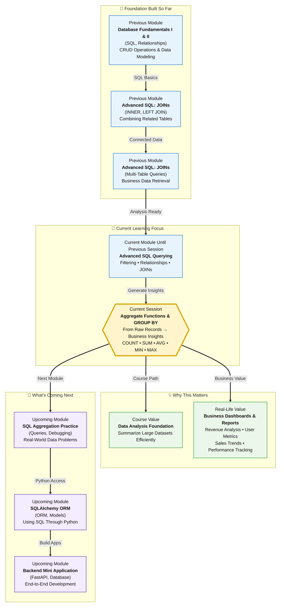

```mermaid id="advanced_sql_aggregation"
%%{init: {
  "flowchart": {
    "nodeSpacing": 40,
    "rankSpacing": 70,
    "diagramPadding": 20
  }
}}%%

flowchart TB

subgraph Foundation["🚀 Foundation Built So Far"]
    P1["Previous Module<br/><b>Database Fundamentals I & II</b><br/>(SQL, Relationships)<br/>CRUD Operations & Data Modeling"]

    P2["Previous Module<br/><b>Advanced SQL: JOINs</b><br/>(INNER, LEFT JOIN)<br/>Combining Related Tables"]

    P3["Previous Module<br/><b>Advanced SQL: JOINs</b><br/>(Multi-Table Queries)<br/>Business Data Retrieval"]
end

subgraph Present["🎯 Current Learning Focus"]
    CM["Current Module Until Previous Session<br/><b>Advanced SQL Querying</b><br/>Filtering • Relationships • JOINs"]

    CS{{"Current Session<br/><b>Aggregate Functions & GROUP BY</b><br/>From Raw Records → Business Insights<br/>COUNT • SUM • AVG • MIN • MAX"}}
end

subgraph Value["💡 Why This Matters"]
    CV["Course Value<br/><b>Data Analysis Foundation</b><br/>Summarize Large Datasets Efficiently"]

    RV["Real-Life Value<br/><b>Business Dashboards & Reports</b><br/>Revenue Analysis • User Metrics<br/>Sales Trends • Performance Tracking"]
end

subgraph Future["🔮 What's Coming Next"]
    U1["Upcoming Module<br/><b>SQL Aggregation Practice</b><br/>(Queries, Debugging)<br/>Real-World Data Problems"]

    U2["Upcoming Module<br/><b>SQLAlchemy ORM</b><br/>(ORM, Models)<br/>Using SQL Through Python"]

    U3["Upcoming Module<br/><b>Backend Mini Application</b><br/>(FastAPI, Database)<br/>End-to-End Development"]
end

P1 ==>|&nbsp;SQL Basics&nbsp;| P2
P2 ==>|&nbsp;Connected Data&nbsp;| P3
P3 ==>|&nbsp;Analysis Ready&nbsp;| CM

CM ==>|&nbsp;Generate Insights&nbsp;| CS

CS ==>|&nbsp;Course Path&nbsp;| CV
CS ==>|&nbsp;Business Value&nbsp;| RV

CS ==>|&nbsp;Next Module&nbsp;| U1
U1 ==>|&nbsp;Python Access&nbsp;| U2
U2 ==>|&nbsp;Build Apps&nbsp;| U3

classDef previous fill:#E8F4FD,stroke:#5B9BD5,stroke-width:2px,color:#111;
classDef current fill:#FFF4CC,stroke:#D6A800,stroke-width:4px,color:#111;
classDef value fill:#EAF7EA,stroke:#67B567,stroke-width:2px,color:#111;
classDef future fill:#F4ECFF,stroke:#8A6FD1,stroke-width:2px,color:#111;

class P1,P2,P3,CM previous;
class CS current;
class CV,RV value;
class U1,U2,U3 future;

linkStyle default stroke-width:3px
```
