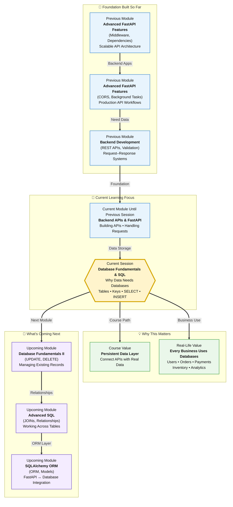

```mermaid
%%{init: {
  "flowchart": {
    "nodeSpacing": 40,
    "rankSpacing": 70,
    "diagramPadding": 20
  }
}}%%

flowchart TB

subgraph Foundation["🚀 Foundation Built So Far"]
    P1["Previous Module<br/><b>Advanced FastAPI Features</b><br/>(Middleware, Dependencies)<br/>Scalable API Architecture"]

    P2["Previous Module<br/><b>Advanced FastAPI Features</b><br/>(CORS, Background Tasks)<br/>Production API Workflows"]

    P3["Previous Module<br/><b>Backend Development</b><br/>(REST APIs, Validation)<br/>Request–Response Systems"]
end

subgraph Present["🎯 Current Learning Focus"]
    CM["Current Module Until Previous Session<br/><b>Backend APIs & FastAPI</b><br/>Building APIs • Handling Requests"]

    CS{{"Current Session<br/><b>Database Fundamentals & SQL</b><br/>Why Data Needs Databases<br/>Tables • Keys • SELECT • INSERT"}}
end

subgraph Value["💡 Why This Matters"]
    CV["Course Value<br/><b>Persistent Data Layer</b><br/>Connect APIs with Real Data"]

    RV["Real-Life Value<br/><b>Every Business Uses Databases</b><br/>Users • Orders • Payments<br/>Inventory • Analytics"]
end

subgraph Future["🔮 What's Coming Next"]
    U1["Upcoming Module<br/><b>Database Fundamentals II</b><br/>(UPDATE, DELETE)<br/>Managing Existing Records"]

    U2["Upcoming Module<br/><b>Advanced SQL</b><br/>(JOINs, Relationships)<br/>Working Across Tables"]

    U3["Upcoming Module<br/><b>SQLAlchemy ORM</b><br/>(ORM, Models)<br/>FastAPI ↔ Database Integration"]
end

P1 ==>|&nbsp;Backend Apps&nbsp;| P2
P2 ==>|&nbsp;Need Data&nbsp;| P3
P3 ==>|&nbsp;Foundation&nbsp;| CM

CM ==>|&nbsp;Data Storage&nbsp;| CS

CS ==>|&nbsp;Course Path&nbsp;| CV
CS ==>|&nbsp;Business Use&nbsp;| RV

CS ==>|&nbsp;Next Module&nbsp;| U1
U1 ==>|&nbsp;Relationships&nbsp;| U2
U2 ==>|&nbsp;ORM Layer&nbsp;| U3

classDef previous fill:#E8F4FD,stroke:#5B9BD5,stroke-width:2px,color:#111;
classDef current fill:#FFF4CC,stroke:#D6A800,stroke-width:4px,color:#111;
classDef value fill:#EAF7EA,stroke:#67B567,stroke-width:2px,color:#111;
classDef future fill:#F4ECFF,stroke:#8A6FD1,stroke-width:2px,color:#111;

class P1,P2,P3,CM previous;
class CS current;
class CV,RV value;
class U1,U2,U3 future;

linkStyle default stroke-width:3px
```
