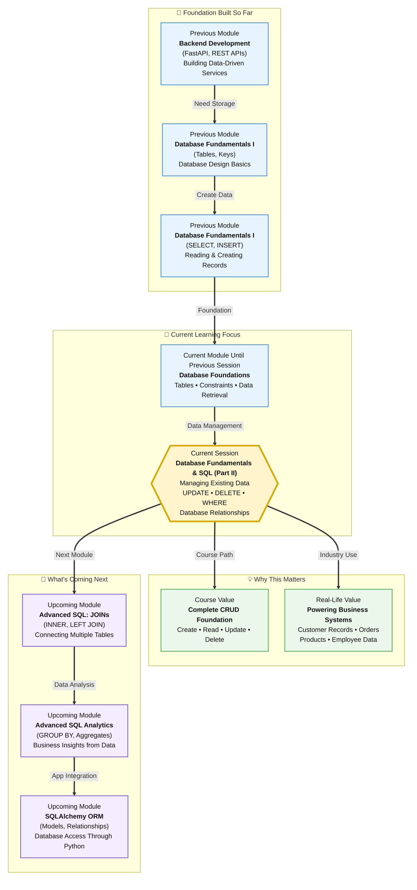

```mermaid id="db_sql_part2"
%%{init: {
  "flowchart": {
    "nodeSpacing": 40,
    "rankSpacing": 70,
    "diagramPadding": 20
  }
}}%%

flowchart TB

subgraph Foundation["🚀 Foundation Built So Far"]
    P1["Previous Module<br/><b>Backend Development</b><br/>(FastAPI, REST APIs)<br/>Building Data-Driven Services"]

    P2["Previous Module<br/><b>Database Fundamentals I</b><br/>(Tables, Keys)<br/>Database Design Basics"]

    P3["Previous Module<br/><b>Database Fundamentals I</b><br/>(SELECT, INSERT)<br/>Reading & Creating Records"]
end

subgraph Present["🎯 Current Learning Focus"]
    CM["Current Module Until Previous Session<br/><b>Database Foundations</b><br/>Tables • Constraints • Data Retrieval"]

    CS{{"Current Session<br/><b>Database Fundamentals & SQL (Part II)</b><br/>Managing Existing Data<br/>UPDATE • DELETE • WHERE<br/>Database Relationships"}}
end

subgraph Value["💡 Why This Matters"]
    CV["Course Value<br/><b>Complete CRUD Foundation</b><br/>Create • Read • Update • Delete"]

    RV["Real-Life Value<br/><b>Powering Business Systems</b><br/>Customer Records • Orders<br/>Products • Employee Data"]
end

subgraph Future["🔮 What's Coming Next"]
    U1["Upcoming Module<br/><b>Advanced SQL: JOINs</b><br/>(INNER, LEFT JOIN)<br/>Connecting Multiple Tables"]

    U2["Upcoming Module<br/><b>Advanced SQL Analytics</b><br/>(GROUP BY, Aggregates)<br/>Business Insights from Data"]

    U3["Upcoming Module<br/><b>SQLAlchemy ORM</b><br/>(Models, Relationships)<br/>Database Access Through Python"]
end

P1 ==>|&nbsp;Need Storage&nbsp;| P2
P2 ==>|&nbsp;Create Data&nbsp;| P3
P3 ==>|&nbsp;Foundation&nbsp;| CM

CM ==>|&nbsp;Data Management&nbsp;| CS

CS ==>|&nbsp;Course Path&nbsp;| CV
CS ==>|&nbsp;Industry Use&nbsp;| RV

CS ==>|&nbsp;Next Module&nbsp;| U1
U1 ==>|&nbsp;Data Analysis&nbsp;| U2
U2 ==>|&nbsp;App Integration&nbsp;| U3

classDef previous fill:#E8F4FD,stroke:#5B9BD5,stroke-width:2px,color:#111;
classDef current fill:#FFF4CC,stroke:#D6A800,stroke-width:4px,color:#111;
classDef value fill:#EAF7EA,stroke:#67B567,stroke-width:2px,color:#111;
classDef future fill:#F4ECFF,stroke:#8A6FD1,stroke-width:2px,color:#111;

class P1,P2,P3,CM previous;
class CS current;
class CV,RV value;
class U1,U2,U3 future;

linkStyle default stroke-width:3px
```
